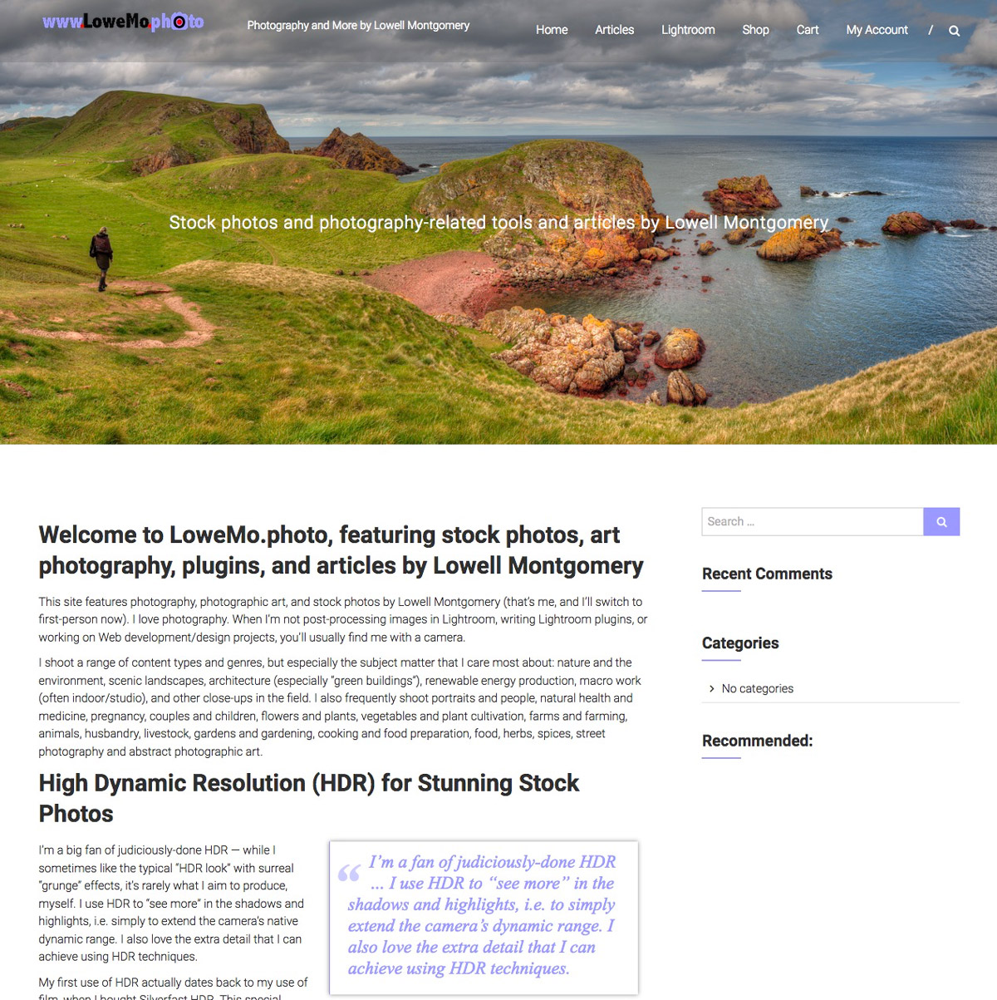

# LoweMo.photo’s Himalayas Child Theme
This is a Wordpress child theme of the popular [Himalayas](https://themegrill.com/themes/himalayas/ "Himalayas - Best Free Modern One Page WordPress Theme 2016") theme. It fixes some things I'm not fond of in the original version. Depending on your needs, this may cause more issues for you than it solves, so use at your own risk. You may wish to fork this to more easily make your own tweaks if my use case does not match yours (and I assume it will not exactly match yours). I built this child theme primarily for use on my photography website, [LoweMo.photo](https://lowemo.photo/ "Stock photos, Art Photography, Plugins, and Articles by Lowell Montgomery").

## What it does:
* Overrides the `text-transform: uppercase;` used in menus, titles, etc. Where I *want* all uppercase, I'll enter it that way.
* Provides a fancier look for `blockquote` elements and a pullquote version that floats right at 50% of the container width. (Wrap such pull-quotes in an `<aside>` element for better behavior with screen-readers and add `pull` as a class attribute of your `<blockquote>`. If you add class attributes of `alignleft` or `alignright` it will take up 50% of the container width and be floated left/right. 
* Removes the Read-more link from the header slider since I'm only using it for a nice header image on the home page. (That header image is set by adding a "Featured Image" to the home page. My original image is 2000 x 889px, but other sizes should work (it looks like the base theme logic creates a version of that which is 1600 x 704px, since that is the maximum width of this theme)
* Removes down-scaling of the site logo displayed in the menu masthead; mine is 250 x 32px, so already fits nicely in the reduced height of the menu bar (which happens as you scroll down and the menu becomes "sticky"). I'm using the default "sticky menu" option and downscaling my site logo didn't look good.
* Removed the background overlay over the parallax header. It gave a "screen" effect, making my image look bad.
* Applied font-weight of bold
* Removed the left border of the site description text shown in the masthead (meant to be a separator between the logo and description, but it didn't look good to me)
* Set `word-wrap` to `"normal"` (not "break-word") and `hyphens` to `"manual"`; Himalayas does not seem to have as big of an issue with strange hyphenation as I've seen, but if the theme authors decide they want to auto-hyphenate, I've already overridden that. (I was seeing some truly ugly hyphenation issues in my previous "premium" theme when I developed this override.)
* Removed the border from images/figcaption boxes. It was set out from the image and looked strange to me.
* Changed the caption text (and blockquote text) font-family to `"Times New Roman", Georgia, serif"`;

## Installation
As a child theme, installation of this theme requires that the Himalayas theme be installed in your Wordpress site. You can then activate this theme. Note that Himalayas is not as responsive as some other themes, so if testing that the "hamburger" menu works when the window is narrow, you will need to reload the page. Until you reload the page, the hamburger menu icon will appear, but clicks on it will bring no joy. Additional Note: I think this behavior could be improved, since it's possible that switching from landscape to vertical display on certain devices might result in a window passing the breakpoint to "hamburger menu". Improving this is a potential to-do.

## Future steps:
This is a very simple sub-theme and, as such, will probably not be actively maintained once I'm happy with it for my short-term use. That said, since it mainly just overrides some of the CSS provided by the base Himalayas theme, it should continue to work when/if any new releases of Himalayas are made available. If you like the changes I've made, you may also like to adapt it to override another base theme.

While I may not do much more with this child theme, I *do* plan to build a full-fledged theme that borrows what I like from other designs (Himalayas, among others) and will likely include a lot of the styling used here. It will likely be built on [Sage](https://roots.io/sage/ "WordPress starter theme with a modern front-end development workflow") 9.x. And will likely be part of a full Wordpress installation base, built on [Bedrock](https://roots.io/bedrock/ "Wordpress Boilerplate with modern development tools"), with support for [Composer](https://getcomposer.org/ "Composer PHP package manager")-based workflows, [Bootstrap 4](http://getbootstrap.com/ "Bootstrap &middot; The world's most popular mobile-first and responsive front-end framework."), [Sass](http://sass-lang.com/ "Sass: Syntactically Awesome Style Sheets"), [Webpack](https://github.com/webpack/webpack "Like Gulp, only supposedly better. ;-)"), [Yarn](https://yarnpkg.com/en/), etc. Building this will be far less trivial, but will provide a lot more power as a starting point for an awesome, maintainable Wordpress site.
